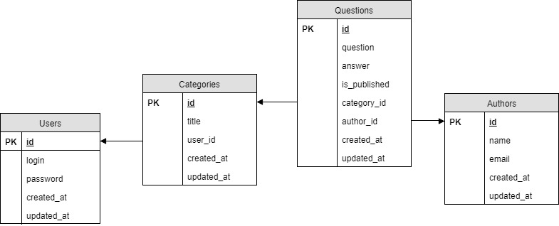

Дипломная работа по курсу «PHP/SQL: back-end разработка и базы данных»
===

Типовой сервис вопросов и ответов, состоящий из клиентской части и интерфейса администратора.

Описание клиентской части:
- Пользователи могут просматривать категории, вопросы и ответы.
- Любой пользователь может задать вопрос, указав своё имя, адрес электронной почты, выбрав категорию и написав текст вопроса.
- Вопросы без ответов не публикуются на сайте.

Вход в интерфейс адмнистратора:
- Для попадания в интерфейс администратора нужно ввести логин и пароль.
- По умолчанию создан единственный администратор с логином admin и паролем admin.

Возможности в интерфейсе администратора:
- Просматривать список администраторов.
- Создавать новых администраторов.
- Изменять пароли существующих администраторов.
- Удалять существующих администраторов.
- Просматривать список тем. По каждой теме в списке видно сколько всего вопросов в ней, сколько опубликовано, сколько без ответов.
- Создавать новые темы.
- Удалять существующие темы и все вопросы в них.
- Просматривать вопросы в каждой теме. По каждому вопросу видно дату создания, статус (ожидает ответа / опубликован / скрыт).
- Удалять любой вопрос из темы.
- Скрывать опубликованные вопросы.
- Публиковать скрытые вопросы.
- Редактировать автора, текст вопроса и текст ответа.
- Перемещать вопрос из одной темы в другую.
- Добавлять ответ на вопрос с публикацией на сайте, либо со скрытием вопроса.
- Видеть список всех вопросов без ответа во всех темах в порядке их добавления. И иметь возможность их редактировать и удалять.
- Действия администраторов должны журналируются в файл ./storage/logs/laravel.log

## Реализация

- Система реализована на базе фреймворка PHP Laravel.
- Использована MVC архитектура.
- Все компоненты реализованы с использованием ООП.
- В качестве шаблонизатора использован Blade, поскольку он входит в состав фреймворка.
- Данные администраторов, тем, вопросов и ответов хранятся в СУБД MySQL.
- Для построения интерфейсов используется библиотека Bootstrap

Схема базы данных:


## Инструкция по первому запуску
- Установить php7.1+
- Установить composer
    ```https://getcomposer.org/```
- Установить laravel
    ```composer global require "laravel/installer"```
- Склонировать проект из репозитория Github
    ```git clone https://github.com/ykornilov/faq```
- Перейти в директорию проекта
- Обновить проект laravel
    ```composer update --no-scripts``` 
- Добавить в MySQL базу данных и пользователя, и внести соответсвующие записи в файл .env (на базе файла .env.example)
- Сгенерировать ключ
    ```php artisan key:generate```
- Отредактировать AppServiceProvider:
    ```use Illuminate\Support\Facades\Schema;
    
    /**
     * Bootstrap any application services.
     *
     * @return void
     */
    public function boot()
    {
        Schema::defaultStringLength(191);
    }```

- Выполнить миграции:
    ```php artisan migrate```
- Инициализировать администратора
    ```php artisan db:seed```
- Перенести проект на хостинг, изменив файл .env в соответствии с настройками базы данных хостинга и переименовав директорию public в директорию, на которую настроен веб-сервер хостинга
- Сделать дамп базы данных и импортировать его на хостинг